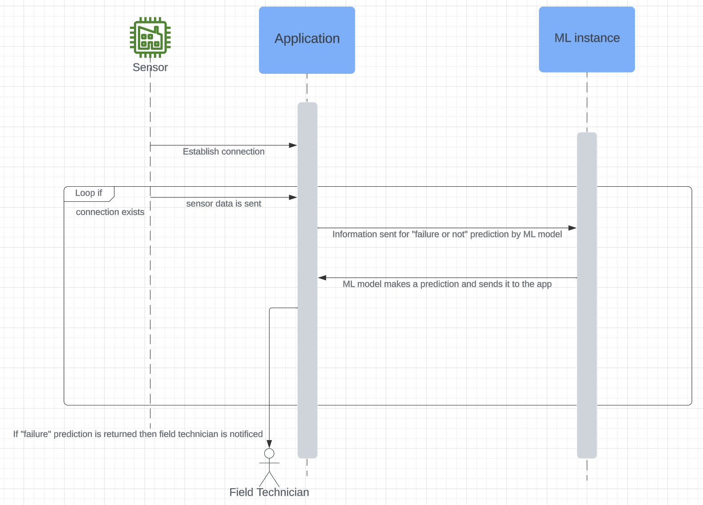

# predictive-maintainance-for-a-smart-factory
This repository contains the code for a predictive maintaincence project. A detailed blog of this project is available [here](https://medium.com/@ataul.akbar/how-to-build-a-predictive-maintainance-system-for-a-smart-factory-mlops-2b251434d7c3).


## Activity diagram

After completing the postman api producer certificate I'll update this project to have used more of postman for api testing

Hmmm I can do github actions with postman cli for api testing. And post the API in postman public workspace <-- Actually don't bother with this, my postman certificate should be good enough.

## Requirements
Make sure you have conda installed. If you want to deploy this app on the web make sure you have a Heroku or Render account.


## Streamlit web app

To access the web deployed version, please follow this link (you will need to wait about a minute for render to build the website) (in the future I plan to replace render with azure webapp service):
```
https://smart-factory-form.onrender.com
```

## Streamlit local app
To start the  app on your local machine, clone this repository then run these commands in your terminal:
```bash
conda activate your_environment_name
conda install --file requirements.txt
streamlit run app.py
```

